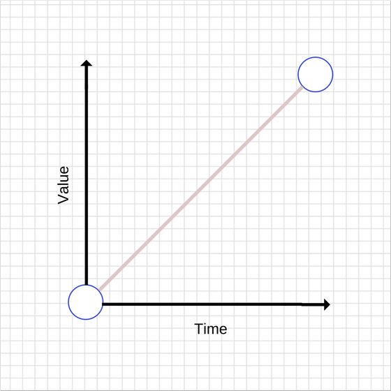
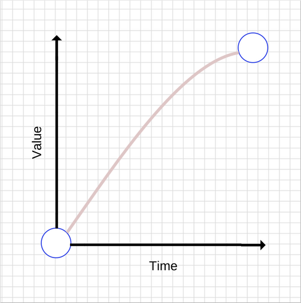

# JavaScript 的工作原理：在 CSS 和 JS 动画的引擎下如何优化他们的表现

### 概要

众所周知，动画在创建引人注目的 web 应用程序中起着至关重要的作用。随着用户越来越多地将注意力转移到用户体验，企业开始意识到完美无瑕，愉快的用户体验的重要性，Web 应用程序变得越来越重，并且具有更加动态的 UI。这一切都需要更复杂的动画，以便在整个用户体验中实现更平滑的状态转换。今天，这甚至没有被认为是特别的东西。用户变得更加先进，进而期望具有高响应性和交互式的用户界面。

但是，动画界面并不一定简单明了。什么样的动画以及什么时候使用动画，动画应该有什么样的感觉，都是棘手的问题。

### JavaScript 与 CSS 动画

创建 Web 动画的两种主要方法是使用 JavaScript 和 CSS。没有绝对正确或错误的选择，这一切都取决于你想要达到的目标。

### 使用 CSS 创建动画

使用 CSS 动画是在屏幕上移动内容的最简单方法。我们将从如何在 X 和 Y 轴上移动 50px 元素的快速示例开始，这是通过使用设置为 1000 毫秒的 CSS 转换完成的。

```css
.box {
  -webkit-transform: translate(0, 0);
  -webkit-transition: -webkit-transform 1000ms;
  transform: translate(0, 0);
  transition: transform 1000ms;
}

.box.move {
  -webkit-transform: translate(50px, 50px);
  transform: translate(50px, 50px);
}
```

当 `move` 类被添加后，`transform` 属性被改变，并且 `transition` 开始。

除了 transition duration 外，还有 easing 选项，这实际上就是动画的感觉。我们将在本文后面更详细地介绍。

如果在上面的代码片段中创建了单独的 CSS 类来管理动画，则可以使用 JavaScript 来打开和关闭每个动画。

如果你有以下元素：

```js
<div class="box">Sample content.</div>
```

然后，你可以使用 JavaScript 来打开和关闭每个动画：

```js
var boxElements = document.getElementsByClassName("box"),
  boxElementsLength = boxElements.length,
  i;

for (i = 0; i < boxElementsLength; i++) {
  boxElements[i].classList.add("move");
}
```

上面的代码片段获取包含具有 `box` 类的所有元素，并添加 `move` 类以触发动画。这样做可以为你的应用提供良好的平衡。你可以专注于使用 JavaScrip t 管理状态，只需在目标元素上设置适当的类，让浏览器来处理动画。如果沿着这条路线前进，你可以在元素上监听 `transitionend` 事件，但前提是你可以放弃对旧版 Internet Explorer 的支持：


在 transition 结束时监听 `transitioned` 事件，如下所示：

```js
var boxElement = document.querySelector(".box"); // Get the first element which has the box class.
boxElement.addEventListener("transitionend", onTransitionEnd, false);

function onTransitionEnd() {
  // Handle the transition finishing.
}
```

除了使用 CSS transition 之外，你还可以使用 CSS animation，这使你可以更好地控制单个动画关键帧，持续时间和迭代。

我们来看一个例子：

```css
/**
 * This is a simplified version without
 * vendor prefixes. With them included
 * (which you will need), things get far
 * more verbose!
 */
.box {
  /* Choose the animation */
  animation-name: movingBox;

  /* The animation’s duration */
  animation-duration: 2300ms;

  /* The number of times we want
      the animation to run */
  animation-iteration-count: infinite;

  /* Causes the animation to reverse
      on every odd iteration */
  animation-direction: alternate;
}

@keyframes movingBox {
  0% {
    transform: translate(0, 0);
    opacity: 0.4;
  }

  25% {
    opacity: 0.9;
  }

  50% {
    transform: translate(150px, 200px);
    opacity: 0.2;
  }

  100% {
    transform: translate(40px, 30px);
    opacity: 0.8;
  }
}
```

[演示地址](https://sessionstack.github.io/blog/demos/keyframes/)

使用 CSS 动画，你可以独立于目标元素定义动画本身，并使用 animation-name 属性选择所需的动画。

CSS 动画仍然在某种程度上以供应商为前缀，在 Safari，Safari Mobile 和 Android 中使用 -webkit。 Chrome，Opera，Internet Explorer 和 Firefox 都没有前缀。许多工具可以帮助你创建所需 CSS 的前缀版本，允许你在源文件中编写未加前缀的版本。

### 使用 JavaScript 动画

与使用 CSS 过渡或动画相比，使用 JavaScript 创建动画更复杂，但它通常为开发人员提供了更多的动力。

JavaScript 动画作为代码的一部分内联编写。你还可以将它们封装在其他对象中。下面是您需要使用 JavaScript 重新编写前面描述的 CSS transition 的代码：

```js
var boxElement = document.querySelector(".box");
var animation = boxElement.animate(
  [{ transform: "translate(0)" }, { transform: "translate(150px, 200px)" }],
  500
);
animation.addEventListener("finish", function() {
  boxElement.style.transform = "translate(150px, 200px)";
});
```

默认情况下，Web 动画仅修改元素的表示。如果你希望将对象保留在移动到的位置，则应在动画完成时修改其基础样式。这就是为什么我们在上面的例子中监听 finish 事件，并将 `box.style.transform` 属性设置为等于 `translate(150px,200px)`，这与我们动画执行的第二次转换相同。

使用 JavaScript 动画，你可以在每一步完全控制元素的样式。这意味着你可以放慢动画速度，暂停动画，停止它们，反转它们，并根据需要操作元素。如果你正在构建复杂的面向对象的应用程序，这尤其有用，因为你可以正确地封装你的行为。

### 什么是 Easing？

自然运动使用户对您的 web 应用感觉更舒适，从而带来更好的用户体验。当然，没有任何东西从一个点到另一个点线性移动。实际上，当事物在我们周围的物理世界中移动时，事物往往会加速或减速，因为我们不是在真空中，并且有不同的因素往往会影响这一点。人类的大脑是有线的，期待这种运动，所以当你在 web 应用程序时中使用动画时，你应该利用这些知识来成为自己的优势。

您需要了解的术语：

- ease in——以慢速开始加速的过渡效果。
- ease out——以快速开始然后减速的过渡效果。

这两者可以组合，例如 "ease in out"。

### Easing 关键字

CSS 过渡和动画允许您选择要使用的缓动类型，有不同的关键字会影响动画的缓和，您也可以完全自定义您的缓动。

以下是一些可以在 CSS 中用来控制缓动的关键字：

- `linear`
- `ease-in`
- `ease-out`
- `ease-in-out`

让我们浏览所有这些，看看它们的真正含义。

### 线性动画（Linear animations）

没有任何缓和的动画被称为线性 `linear`。

以下是线性过渡的图形：



随着时间的推移，value 值会增加。对于线性运动，事物往往会让人感觉不自然。一般来说，你应该避免线性运动。

以下是如何实现简单的线性动画：

```css
transition: transform 500ms linear;
```

### 减速动画（Ease-out animations）

如前所述，与线性动画相比，ease-out 会使动画更快地启动，而最后会减慢动画。它的图形如下：



一般来说，ease-out 最适合用于 UI 工作，因为快速启动可以让动画更具有响应感，而由于运动不一致，最后的减速让人感觉很自然。

有很多方法可以实现 ease-out 效果，但最简单的是在 CSS 中使用 ease-out 关键字：

```css
transition: transform 500ms ease-out;
```
