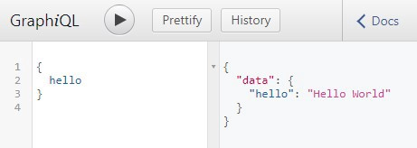

# GraphQL 简介：工作原理以及如何使用

GraphQL 是 API 的查询语言，它显示了服务器提供的不同类型的数据，然后客户端可以准确地选择它想要的内容。

同样在 GraphQL 中，你可以一次性调用多个服务器资源，而不在需要进行多个 REST API 调用。

你可以通过访问 [https://graphql.org/](https://graphql.org/) 来了解 GraphQL 的所有优点。我们必须在实践中使用 GraphQL，或者你很难理解它的优点，那么就让我们开始使用 GraphQL 吧~

我们将在本文中使用 GraphQL 和 NodeJS。

## 先决条件

安装 NodeJS：[https://nodejs.org/en/](https://nodejs.org/en/)

## 如何将 GraphQL 与 NodeJs 一起使用？

GraphQL 可以与多种语言一起使用，这篇文章中，我们将重点介绍如何使用 NodeJS 将 GraphQL 与 JavaScript 结合使用。

新建一个名为 graphql-with-nodejs 的文件夹，进入项目文件夹并运行 npm init 来创建 NodeJS 项目，终端命令如下：

```js

cd graphql-with-nodejs
npm init

```

## 安装依赖项

使用以下命令安装 Express：

```js
npm install express
```

我们将使用以下命令安装 GraphQL 和 GraphQL for Express：

```js

npm install express-graphql graphql

```

### NodeJS 代码

在项目中创建一个名叫 server.js 的文件，并将以下代码复制到其中：

```js
const express = require("express");
const port = 5000;
const app = express();

app.get("/hello", (req, res) => {
  res.send("hello");
});

app.listen(port);
console.log(`Server Running at localhost:${port}`);
```

上面的代码有一个名为 /hello 的 HTTP GET 请求，这个请求是使用 Express 创建的。现在，让我们修改此代码来启用 GraphQL。

### 在代码中启用 GraphQL

GraphQL 有一个名为 /graphql 的 URL 端点，它将处理所有的请求。

将以下代码复制到 server.js 中：

```js
//get all the libraries needed
const express = require("express");
const graphqlHTTP = require("express-graphql");
const { GraphQLSchema } = require("graphql");

const { queryType } = require("./query.js");

//setting up the port number and express app
const port = 5000;
const app = express();

// Define the Schema
const schema = new GraphQLSchema({ query: queryType });

//Setup the nodejs GraphQL server
app.use(
  "/graphql",
  graphqlHTTP({
    schema: schema,
    graphiql: true
  })
);

app.listen(port);
console.log(`GraphQL Server Running at localhost:${port}`);
```

现在让我们来看看这段代码吧~

graphqlHTTP 使我们能够在 /graphql url 中设置 GraphQL 服务器，它知道如何处理即将发生的请求。这个设置在以下代码行中完成：

```js
app.use(
  "/graphql",
  graphqlHTTP({
    schema: schema,
    graphiql: true
  })
);
```

现在，让我们来一起探索 graphqlHTTP 中的参数吧~

### graphiql

graphiql 是一个 Web UI，您可以使用它来测试 GraphQL 资源路径。我们将其设置为 true，以便更容易测试我们创建的各种 GraphQL 端点。

### schema

GraphQL 只有一个外部资源路径 /graphql，这个资源路径可以有多个其他资源路径执行各种操作，这些资源路径将在 schema 中指定。

schema 将执行以下操作：

- 指定资源路径

- 指示资源路径的输入和输出字段

- 指示在命中资源路径时应执行的操作，依此类推。

schema 在代码中定义如下：

```js
const schema = new GraphQLSchema({ query: queryType });
```

schema 可以包含**查询**和**变更**类型，但是这篇文章将仅关注查询类型。

### 查询（query）

你可以在 schema 中看到查询已设置为 queryType，我们使用以下命令从 query.js 文件中导入 queryType：

```js
const { queryType } = require("./query.js");
```

query.js 是我们即将创建的自定义文件，query 是我们在 schema 中指定只读端点的地方。

在项目中新建一个名为 query.js 的文件，并将以下代码复制到其中：

```js
const { GraphQLObjectType, GraphQLString } = require("graphql");

//Define the Query
const queryType = new GraphQLObjectType({
  name: "Query",
  fields: {
    hello: {
      type: GraphQLString,

      resolve: function() {
        return "Hello World";
      }
    }
  }
});

exports.queryType = queryType;
```

### 查询说明

queryType 创建为 GraphQLObjectType 并命名为 Query。（queryType is created as a GraphQLObjectType and given the name Query.）

字段是我们指定各种资源路径的地方，因此我们在这里添加一个名为 hello 的资源路径，hello 有一个 GraphQLString 类型，这意味着该资源路径的返回类型为 String。这里的类型是 GraphQLString 而不是 String，因为这是 GraphQL scheme，因此直接使用 String 是不行的。

resolve 函数表示调用端点时要执行的操作，这里的操作是返回一个字符串 Hello World。

最后，我们用 exports.queryType = queryType 导出 querytype，这是为了确保我们可以在 server.js 中导入它。

### 运行应用程序

使用以下命令运行应用程序：

```js
node server.js
```

你可以通过访问 localhost:5000/graphql 本地运行和测试该程序。

此 URL 在 Graphiql Web UI 中运行，如下图所示：



在左边输入相应查询，右边为相应的输出。输入以下查询：

```js
{
  hello;
}
```

则右边会对应输出以下内容：

```js
{
  "data": {
    "hello": "Hello World"
  }
}
```

### 恭喜你！😃

你已经创建了第一个 GraphQL 资源路径。

### 添加更多资源路径

我们将会创建 2 个新的资源路径：

- **movie**：这个资源路径将会返回指定电影 ID 的电影
- **director**：这个资源路径将返回指定导演 ID 的导演，它还将返回该导演指导的所有电影。

### 添加数据

通常，一个应用程序将从数据库中读取数据。但是对于本教程，我们将简单地对代码本身中的数据进行硬编码。

创建一个名为 data.js 的文件，并添加以下代码：

```js
//Hardcode some data for movies and directors
let movies = [
  {
    id: 1,
    name: "Movie 1",
    year: 2018,
    directorId: 1
  },
  {
    id: 2,
    name: "Movie 2",
    year: 2017,
    directorId: 1
  },
  {
    id: 3,
    name: "Movie 3",
    year: 2016,
    directorId: 3
  }
];

let directors = [
  {
    id: 1,
    name: "Director 1",
    age: 20
  },
  {
    id: 2,
    name: "Director 2",
    age: 30
  },
  {
    id: 3,
    name: "Director 3",
    age: 40
  }
];

exports.movies = movies;
exports.directors = directors;
```

此文件包含 movies 和 directors 数据，我们将使用此文件中的数据作为资源路径。

### 将 movie 资源路径添加到查询中

新的资源路径将被添加到 query.js 文件中的 queryType 中。

```js
movie: {
            type: movieType,
            args: {
                id: { type: GraphQLInt }
            },
            resolve: function (source, args) {
                return _.find(movies, { id: args.id });
            }
        }
```

这个请求的返回类型是 movieType，将很快被定义。

args 参数用于指示 movie 请求的输入，这个请求的输入是 id，其类型为 **GraphQLInt**。resolve 函数从电影列表中返回与 id 相匹配的电影。**find** 是一个 lodash 中的函数，用于查找列表中的元素。

query.js 的完整代码如下所示：

```js
const { GraphQLObjectType, GraphQLString, GraphQLInt } = require("graphql");
const _ = require("lodash");

const { movieType } = require("./types.js");
let { movies } = require("./data.js");

//Define the Query
const queryType = new GraphQLObjectType({
  name: "Query",
  fields: {
    hello: {
      type: GraphQLString,

      resolve: function() {
        return "Hello World";
      }
    },

    movie: {
      type: movieType,
      args: {
        id: { type: GraphQLInt }
      },
      resolve: function(source, args) {
        return _.find(movies, { id: args.id });
      }
    }
  }
});

exports.queryType = queryType;
```

从上面的代码中，我们可以看到 **movieType** 实际上是在 **types.js** 中定义的。

### 添加自定义类型 movieType

创建一个名为 types.js 的文件，添加以下代码：

```js
const {
  GraphQLObjectType,
  GraphQLID,
  GraphQLString,
  GraphQLInt
} = require("graphql");

// Define Movie Type
movieType = new GraphQLObjectType({
  name: "Movie",
  fields: {
    id: { type: GraphQLID },
    name: { type: GraphQLString },
    year: { type: GraphQLInt },
    directorId: { type: GraphQLID }
  }
});

exports.movieType = movieType;
```

可以看出 movieType 是以 GraphQLObjectType 创建的，它有 4 个字段：id，name，year 和 directorId，在添加这些字段时，也会指定每个字段的类型。这些字段直接从数据中来的，在我们的这个例子中，它将来自电影列表。

### 为 director 请求添加查询和类型

像电影一样，甚至还可以添加导演请求。
在 query.js 中，可以按如下方式添加 director 请求：

```js
director: {
            type: directorType,
            args: {
                id: { type: GraphQLInt }
            },
            resolve: function (source, args) {
                return _.find(directors, { id: args.id });
            }
        }
```

可以在 types.js 中添加 directorType 的代码：

```js
//Define Director Type
directorType = new GraphQLObjectType({
  name: "Director",
  fields: {
    id: { type: GraphQLID },
    name: { type: GraphQLString },
    age: { type: GraphQLInt },
    movies: {
      type: new GraphQLList(movieType),
      resolve(source, args) {
        return _.filter(movies, { directorId: source.id });
      }
    }
  }
});
```
可以看出 **directorType** 与 **movieType** 略有不同，为什么会这样呢？为什么 **directorType** 中有解析函数？以前我们看到解析函数不是只出现在查询中...

### directorType 的特殊性


