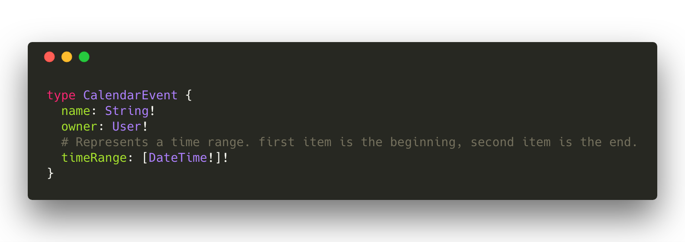
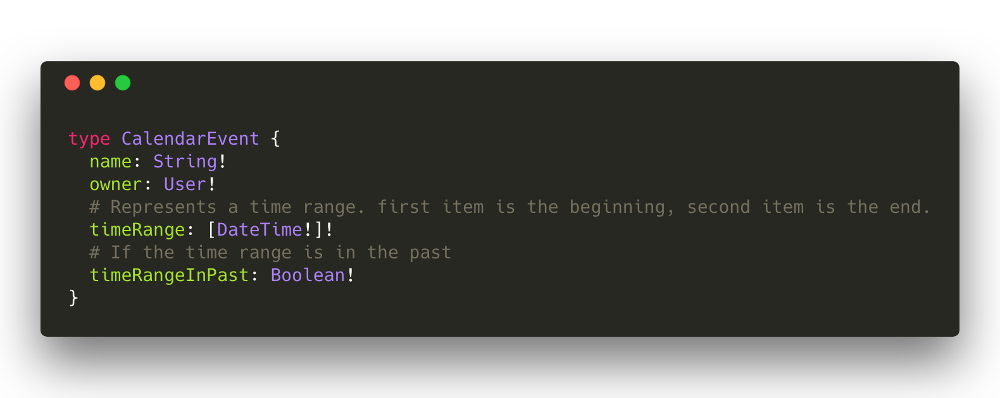
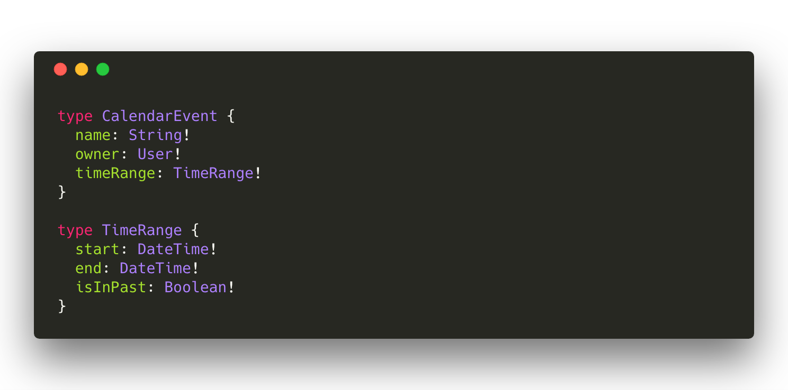

# GraphQL Schema 设计：构建可演化架构

> 这是 Marc-Andre Giroux 的客座文章，他目前正在 GitHub 的生态系统 API 团队工作。他一直在编写和思考 GraphQL 持续演化和模式设计。如果您需要一些 GraphQL 帮助，可以通过 marc@mgiroux.me 与他联系。

虽然 GraphQL 允许我们不断改进我们的 schemas，例如使用 deprecations，但我们不应该轻易地弃用 schema 成员。最后，在最好的情况下，deprecation 仍然需要所有集成商的工作，并且对于在最坏情况下没有进行更改的任何人来说，这是一个重大改变。

虽然可以通过更好的工具和文档（例如我们在 [GitHub](https://developer.github.com/v4/changelog/) 上 [build](https://developer.github.com/v4/breaking_changes/) 的文档）以更简单的方式进行这些更改，但是我们必须记住，如果我们想要一个让（integrators）集成商信任并且稳定的 API，那么使用（deprecations）弃用应该绝对是最后的手段。

好消息是，有一些方法可以构建我们的 GraphQL schema，以避免将来发生严重的重大变化。在构建 API 时，我们必须记住，事情会发生变化，并在发生这种情况时为自己的成功做好准备。在这篇文章中，我们将探讨在为未来设计 API 时可以提供帮助的一些事项。

### 1. Prefer Object Types over simpler structures

以此 `CalendarEvent` 类型为例，注意 timeRange 字段，它表示事件何时开始并结束。乍一看，这看起来还不错。我们有一个列表类型，它可能与我们内部的匹配，在索引为 0 的数组开始，索引 1 为结尾。

现在如果我们想要添加更多与该范围相关的数据呢？例如，该时间范围是过去还是将来？在它的当前状态中，我们必须向 `CalendarEvent` 添加一个字段。我们将其命名为 `timeRange` ，好让我们的集成商（integrators）知道它们是相关的。或者最糟糕的是，我们最终会弃用 `timeRange` 并为 `timeRange` 字段做出不同的设计。

这里的问题是我们无法在同一个 `timeRange` 字段中添加这些数据，因为我们遇到了一个扁平的 `DateTime` 数组。如果我们用不同的方式设计 `timeRange` 字段会怎么样？如果我们在这里使用了一个对象类型而不是一个数组，我们最终会得到如下的结果：

这样做更好的原因主要有以下几点：

1. 我们可以轻松地为 `TimeRange` 类型添加任何我们想要的额外数据。
2. 我们已经命名了我们的字段，而不是使用数组索引，这对于集成商（integrators）来说非常有用。
3. 相关数据在单个类型中就能找到，而不需要通过字段名称前缀来执行此操作。

试着想一下你为你的字段或参数使用的类型是否是未来不会改变的。如有疑问，请使用更复 ​​ 杂的结构，如 object 类型或 input 类型。

### 2.有疑问时，具体命名

当我们开始构建 GraphQL Schema 时，我们可以使用名称的整个命名空间。在创建一个新类型时，我们很容易使用最简单的方法来描述新实体。例如，采用 `Comment` 类型来描述某人在 SomeSocialMedia™ 上发布的帖子的评论。

在有一段时间内，这对我们来说可能是完美的。但是，我们最终可能会引入另一种评论，而这个评论实际上和之前的是不同的。例如，这个新的评论类可能是新的应用程序反馈的表单评论。它的目的是完全不同的，它有不同的字段，但也有共同的字段。

现在我们必须将新评论命名为 `FeedbackFormComment`，我们坚持使用代表帖子评论的通用对象类型 `Comment`。试想一下，如果我们想要建立一个 `Comment` 接口，我们就会意识到我们有一些具有相同行为的类型，那么我们的帖子评论现在已经窃取了接口的通用名称了 😾。

现在我们需要解决使用 `Comment` 类型弃用所有字段的长期难题。使用不太理想的名称创建接口，删除旧字段，最后将接口重命名为 `Comment`，经历这个过程并不是一件有趣的事情。

像这样的类型更改需要以下 3 个步骤才能完成：

1. 弃用现有字段，并使用新名称和临时名称创建新字段。
2. 删除具有所需名称的所有现有成员，并弃用新创建的字段，因为我们需要将它们重命名为所需的名称。
3. 删除临时字段，然后添加它们使用所需名称，现在可以自由的使用了。

如果我们最初将我们的类型命名为 `PostComment`，那么将为我们留出一些空间来清楚地定义 `Comment` 是什么。

### 3.首选字段和类型而不是自定义标量

使用 GraphQL 的类型系统很难描述某些结构。例如，递归数据结构很难用 GraphQL 构建，可能需要我们使用自定义标量来正确表示。

但在大多数情况下，GraphQL 的类型系统为我们提供了足够的工具来模拟我们 schema 中的任何内容，而不是依赖于 JSON 标量或任何自定义标量。

过度使用自定义标量存在以下一些问题：

1. 
