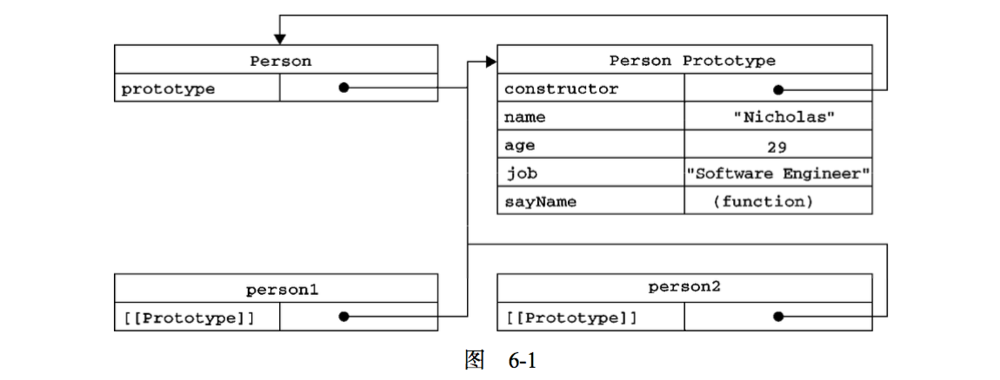

# 创建对象

虽然使用 Object 构造函数或对象字面量都可以用来创建单个函数，但是有一个明显的缺点：使用同一个接口创建很多对象，会产生大量的重复代码。于是出现其他的方式来创建对象，主要有以下 6 种方式：

#### 工厂模式

```js
function test(name, age) {
  var o = new Object();
  o.name = name;
  o.age = age;
  o.sayName = function() {
    console.log(this.name);
  };
  return o;
}
var t1 = test("may", 12);
```

#### 构造函数模式

```js
function Test(name, age) {
  this.name = name;
  this.age = age;
  this.sayName = function() {
    console.log(this.name);
  };
}
var t1 = new Test("may", 12);
var t2 = new Test("mike", 19);
```

使用 new 操作符，相当于经历了以下四个步骤：

1. 创建一个新对象
2. 将构造函数的作用域赋给新对象（this 指向新的对象）
3. 执行构造山函数中的代码（为这个新对象添加属性）
4. 返回新对象

t1 有一个 constructor 属性，该属性指向 Test：

```js
console.log(t1.constructor === Test); // true
```

此实例中创建的对象是 Object 的实例，同时也是 Test 的实例，可以通过 instanceof 操作符来验证：

```js
console.log(t1 instanceof Object); // true
console.log(t1 instanceof Test); // true
```

##### 构造函数

任何函数，只要通过 new 操作符来调用的函数，那么它就可以作为构造函数。如果上面的 Test 函数不适用 new 来调用，那么它的属性和方法都会被添加到 window 对象上：

```js
Test("alice", 20);
window.sayName(); // alice
```

构造函数模式缺点：

每个方法都要在每个实例上重新创建一遍,方法无法共享。

```js
t1.sayName == t2.sayName; // false
```

#### 原型模式

```js
function Test() {}
Test.prototype.name = "jack";
Test.prototype.age = 20;
Test.prototype.sayName = function() {
  console.log(this.name);
};
var t1 = new Test();
var t2 = new Test();
t1.sayName === t2.sayName; // true
```

##### 原型对象

只要创建了一个新函数，就会为该函数创建一个 prototype 属性，这个属性指向函数的原型对象



hasOwnProperty()方法可以用来检测一个属性是存在实例中还是存在于原型中：

```js
t1.hasOwnProperty("name"); // false
t1.name = "amx";
t1.hasOwnProperty("name"); // true
```
